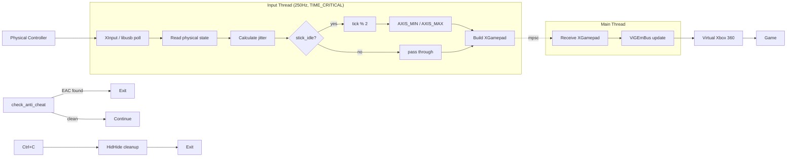

##  BetterAimAssist
Virtual Xbox controller proxy that adds rapid axis jitter to boost aim assist in PC games.

### &nbsp;&nbsp;Architecture



### &nbsp;&nbsp;Features

- Supports **Xbox**, **DualSense (PS5)** and **DualShock 4 (PS4)** controllers
- Direct **libusb** for Sony controllers — lower latency than hidapi
- Automatic driver detection — opens download page if something is missing
- Hides physical controller via **HidHide** (no double input)
- **EasyAntiCheat detection** — refuses to run if EAC is active
- Mirrors all buttons, triggers and sticks in real time
- **F5** toggles jitter on/off — **L2** activates while held
- Jitter pauses when you move the left stick
- **4ms polling** (250Hz) with spin-wait timing
- High-priority input thread for consistent timing
- Graceful exit with **Ctrl+C**

### &nbsp;&nbsp;Structure

```
src/
├── main.rs                # Entry point
├── build.rs               # Windows resources
├── Cargo.toml             # Dependencies
└── resources/
    └── BetterAimAssist.manifest
```

### &nbsp;&nbsp;Controller Support

**Xbox** — Full support via XInput. USB and Bluetooth.

**DualSense / DualShock 4** — Direct libusb. USB and Bluetooth.

| PS | Xbox |
|----|------|
| Cross | A |
| Circle | B |
| Square | X |
| Triangle | Y |
| L1/R1 | LB/RB |
| L2/R2 | LT/RT |
| L3/R3 | LS/RS |
| Options/Create | Start/Back |
| D-Pad | D-Pad |

> **Note:** Close Steam, DS4Windows or any other app that might be using the controller before running BetterAimAssist.

### &nbsp;&nbsp;Game Compatibility

| Game | Status |
|---|---|
| Fortnite | Works |
| Warzone / Modern Warfare | Probably works (untested) |
| Apex Legends | Probably works (untested) |

### &nbsp;&nbsp;Installation

1. Install **[ViGEmBus](https://github.com/nefarius/ViGEmBus/releases)** and **[HidHide](https://github.com/nefarius/HidHide/releases)** (reboot required for HidHide)
2. Download `BetterAimAssist.exe` from **[Releases](https://github.com/Kira-Kohler/BetterAimAssist/releases)**
3. Run as **Administrator**

> **Always open BetterAimAssist *before* your game.**

### &nbsp;&nbsp;Requirements

| Requirement | Details |
|-------------|---------|
| OS | Windows 10 / 11 x64 |
| Controller | Xbox (wired or Bluetooth), DualSense (PS5), DualShock 4 (PS4) ||

### &nbsp;&nbsp;Troubleshooting

| Problem | Fix |
|---------|-----|
| **EAC detected on startup** | Close the game first |
| **Controller not detected** | Wait 10s or reconnect Bluetooth |
| **Double input** | Launch tool *before* the game |
| **Access denied** | Run as Administrator |
| **Bluetooth Xbox not detected** | Unpair and re-pair in Windows Settings |
| **PS4/PS5 controller not opening** | Close Steam, DS4Windows or any other app using the controller |
| **HidHide CLI not found** | Reboot your PC after installing HidHide |

### &nbsp;&nbsp;Building from Source

```bash
Requires Rust 1.75+ (https://rustup.rs) and Windows
git clone https://github.com/Kira-Kohler/BetterAimAssist
cd BetterAimAssist
cargo build --release
# Output → target/release/BetterAimAssist.exe
```

### &nbsp;&nbsp;License

MIT — do whatever you want with it.